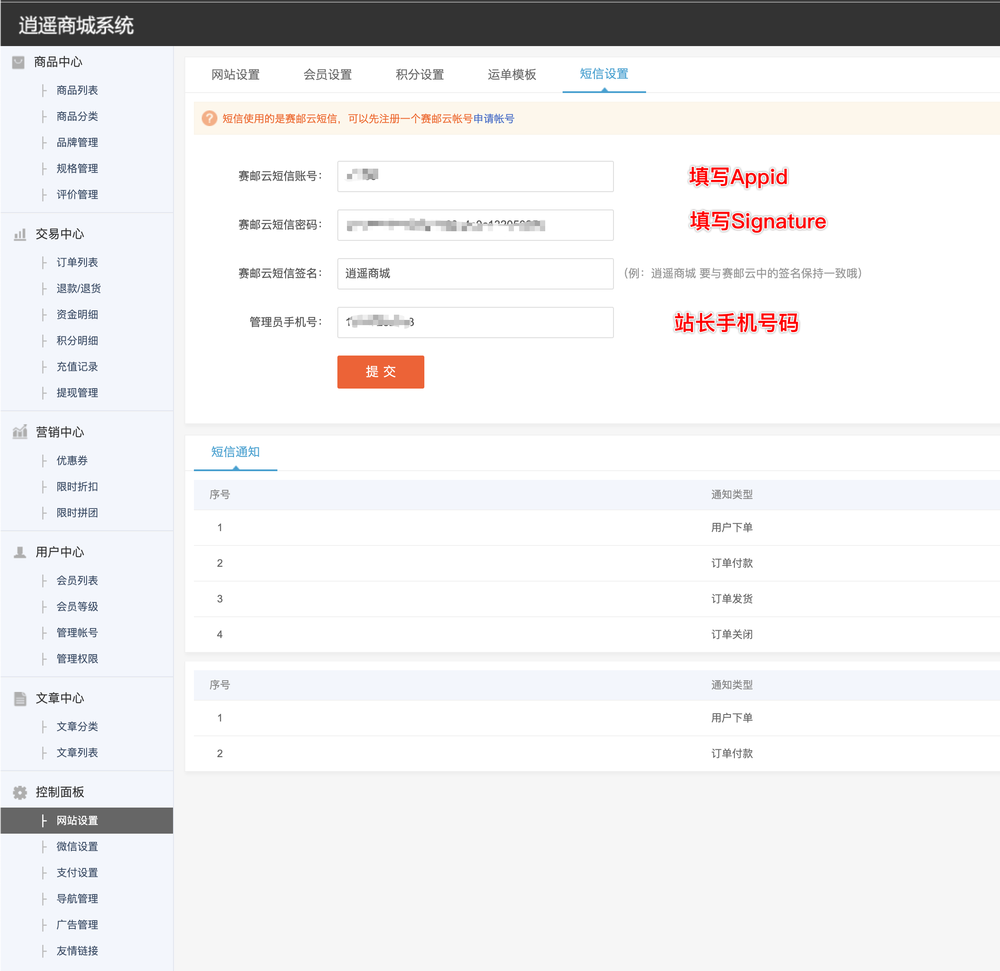

## OVERVIEW

### 逍遥商城 Plug-Ins Overview

>逍遥B2C商城系统是一款基于开源框架开发的商城系统，支持PC+H5
------

逍遥B2C商城  [官网地址](http://www.qiye1000.com/)

How to use

-	admin/template/setting_sms.html
-	hook/notice.hook.php
-	hook/qunfa.hook.php

使用方法
    把下载好的逍遥商城 赛邮云短信插件程序解压覆盖到网站根目录
    找到 系统->短信发送设置

    点击安装 后

    配置好申请的appid 和 appkey

[Github项目地址](https://github.com/submail-developers/xyshop_sms/)&nbsp;&nbsp;&nbsp;[点击下载](https://github.com/submail-developers/xyshop_sms/archive/master.zip)

